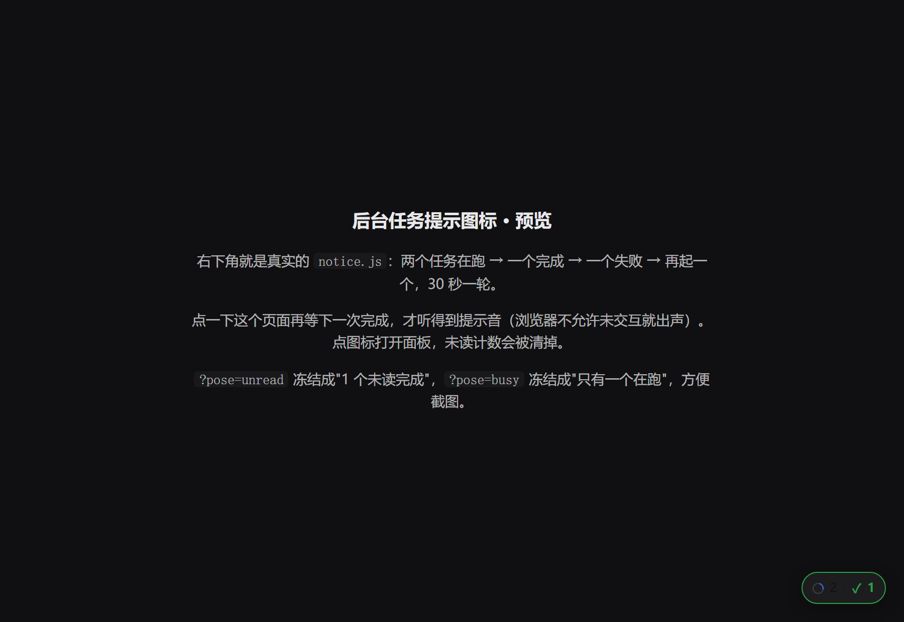
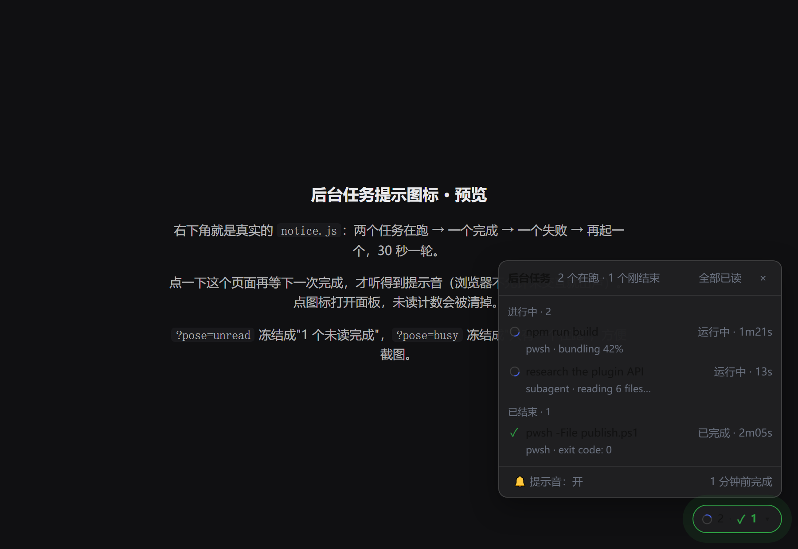

# dsh-job-badge

A background-task badge for the [DeepSeek Harness](https://github.com/deepseek-ai/deepseek-harness) Web GUI: a small chip in the corner that counts what is still running, turns green with an unread number when something finishes, plays a chime, and opens a task panel on click.

[中文说明](README.zh-CN.md)

| 2 running + 1 just finished | the panel, opened |
|---|---|
|  |  |

Why it exists: DSH runs background work (a `run_in_background` shell call, a background subagent). When it finishes, the *model* gets a completion notice and the *human* gets nothing — no badge, no sound, nothing like the "-1" background icon Codex shows. This plugin is that missing signal.

## What it does

- **Idle = nothing rendered at all.** An always-on badge gets ignored; this one only exists when there is something to say.
- **Running**: `◌ 2` — a real spinner plus the count.
- **Just finished**: `✓ 1` — accent outline, a pulse, a two-note chime (rising for success, falling for failures), and a `(1) ` prefix on the window title so a background taskbar still tells you.
- **Clicking is looking**: the panel opens and the unread count clears. The count lives in the Host, so two open windows cannot disagree about it.
- **Minimized**: the in-page chip is invisible by definition, so a completion also plays the chime and sets the taskbar badge (`navigator.setAppBadge`).
- **Foreground commands never light it.** A foreground shell call waits on its own job (`registry.wait(id, …)`) and removes the record right after, so its settlement arrives with `awaited: true` and its result is surfacing in the conversation at that moment. The registry publishes that flag for exactly this purpose — *"so a completion reporter can skip settlements a waiting caller already collected"* — and honouring it is what stopped **every tool call from chiming once**. A background job has no waiter, arrives with `awaited: false`, and does light the badge. Tested in both directions.

## How it works

```
ctx.jobs.events.subscribe({ owners: 'all' })     the whole process's jobs, every session
        │ registered / progress / stopping / settled / removed
        ▼
   tracker (pure, unit-tested)  →  GET  /job-badge/state-<stamp>.json    snapshot (poll + curl)
                                   GET  /job-badge/stream-<stamp>       SSE, one frame per change
                                   POST /job-badge/ack-<stamp>.json     clear the unread count
                                   GET  /job-badge/ui-<stamp>.js        the badge itself
        ▼
   one <script> row injected into index.html (its data-* attributes carry the three routes)
        ▼
   notice.js: paint, poll every 2.5s, update instantly when the stream delivers
```

- The **Host half owns the state** because `ctx.jobs` is process-wide: a page can only see one session's roster, and the whole point of a background task is that you are looking somewhere else.
- The page half is **plain DOM served by the Host and injected as a `<script>` row**, not a `dsh.client` module: a client module only loads from the module graph built at boot, so a bundle installed into a running Host never appears there.
- Every route carries a **load stamp** (the plugin file's own mtime). Re-registering a fixed path throws `webserver: duplicate undefined route`, and that error does not merely fail the new instance — it orphans the old one outside the loader. A stamped generation cannot collide, and a second `apply()` of the same generation finds the stamp mounted and does nothing.
- **Polling is the transport, SSE is the accelerator.** The desktop shell serves the page through a custom scheme whose handler forwards to the Host, so a plain poll is the one path no layer in between can break.
- Job labels are model-authored text. They reach the DOM through `textContent` only: there is no `innerHTML` in `notice.js`, and the browser suite feeds it `` and `<script>` labels to prove it.

## Install

```powershell
plugin_manager install_bundle  target: file:<this repo>
```

Two things about installing into a **running** Host are worth knowing, both measured:

1. **The desktop shell must restart once for the badge to appear.** The Host hands its index-injection table to the Electron main process at startup (`process.send({ type: 'ready', …, injections: ctx.webServer.collectIndexInjections() })`), and the page receives that same startup snapshot over IPC on every load. A page refresh re-applies the old table, and this production build has no "reload page" menu item (Electron adds `role: "reload"` only when `development`). The plain `dsh web` browser flow is different: there the index is rendered per request, so a refresh is enough.
2. **A `file:` dependency is hardlinked, and writing a file breaks the link.** After editing the source, `install_bundle` alone reports "Already up to date" and changes nothing — remove and re-add the bundle, then check:

```powershell
plugin_manager remove_bundle  target: @local/dsh-job-badge
plugin_manager install_bundle target: file:<this repo>
node test/verify-live.mjs      # compares the two copies, and says which generation answers
```

`verify-live.mjs` reporting **PARTIAL** is expected right after an edit: Node caches ES modules by URL, so a Host that keeps running serves the generation it imported first, at that first import's stamp.

## Config

`~/.dsh/profiles/desktop/cordis.patch.yml`, or the bundle's own `cordis.patch.yml`:

```yaml
- id: job-badge
  name: '@local/dsh-job-badge'
  config:
    position: bottom-right   # bottom-right | bottom-left | top-right | top-left
    sound: always            # always | hidden (only when the page is not visible) | never
    notify: never            # always | hidden | never — OS banner, off by default (see below)
    volume: 0.35             # 0 .. 1
    keepMinutes: 30          # how long a finished job stays listed
    maxRows: 40              # hard cap on finished rows
    stream: true             # false leaves plain polling
```

`notify` is off by default for a measured reason: on a machine whose Windows notifications are switched off (`HKCU\SOFTWARE\Microsoft\Windows\CurrentVersion\PushNotifications\ToastEnabled = 0`) no banner appears — not from the page, and not from a PowerShell toast either (both verified). The badge, the taskbar number and the chime are the channels that actually arrive, so nothing depends on a banner.

Config changes hot-apply: the Host re-applies the entry and the page picks up the new `ui` block on its next frame. No restart, no reload.

## Verify

```powershell
node test/tracker-test.mjs     # Host half: 117 assertions (pure tracker + routes/subscription/
                               # injection/cleanup against a fake Host)
node test/notice-render.mjs    # real browser (headless Edge + CDP): 50 assertions over the live DOM
node test/verify-live.mjs      # against the running Host: copies in sync? which generation answers?
node test/preview.mjs          # watch the real notice.js on http://127.0.0.1:8799/ without DSH
```

`notice-render.mjs` is not a "the source contains this string" check. It runs a local server playing every role the Host plays (state, SSE, ack), loads the real `notice.js` into headless Edge, and reads the live DOM back: nothing rendered when idle, `2` and spinning while two jobs run, a pushed completion turning it into a green `✓ 1` with a `(1)` title, a click opening the panel and POSTing an ack, Escape closing it, the whole element removing itself when everything clears, and a hostile label producing text rather than an element. Two of its cases apply the **real injection row produced by `apply()`** — one by HTML parsing, one the way the Electron shell does it (`createElement('script')` + `textContent` + `append`) — so "the injected row itself can mount the badge" is pinned too.

Measured against the live Host, not assumed:

| check | result |
|---|---|
| `GET /job-badge/state-<stamp>.json` | 200 with real counts |
| a real background job (`pwsh-167`, 30s) | present in `running` while it ran |
| after it settled | `status=completed`, `duration=30.5s`, `detail=exit code: 0`, `unseen=1` |
| a dozen foreground `pwsh` calls in between | did **not** pollute the unread count |

## Limitations, stated plainly

- The unread count is Host memory: an app restart clears it. History stays listed — `seed()` adopts jobs that were already settled as history rather than as "you missed this", because nobody was watching that collector.
- `cause: 'teardown'` settlements do not light the badge: the owner is being destroyed and no reader is left.
- The title prefix strips a leading `(N) ` if something else put one there. Rare, and the self-healing rewrite is worth it.
- Hidden pages have their timers throttled by Chromium; the SSE frame is what makes the chime land on time, and the poll is the floor.
- **Not in scope**: turn/session-completion notices (the same plumbing extends to `api-session/status` or `agent/status`), and a taskbar flash — that needs the Electron shell, which a plugin cannot reach.
